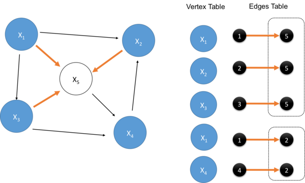

# Homework 2: Real-world SQL queries and scalable algorithms
### CS186, UC Berkeley, Spring 2016
### Points: [10% of your final grade](https://sites.google.com/site/cs186spring2016/home/basic-information)
### Due: Thursday Feb 11, 2016, 11:59 PM
### Note: *This homework is to be done individually!*


###Description and Set Up
This assignment aims to consolidate basic SQL skills and demonstrate the power of SQL via some interesting
graph algorithms.

You will be using SQLite and Python, via the Jupyter notebook interface. Should you run into any setup
issues, remember that [hw0](https://github.com/berkeley-cs186/course/tree/master/hw0) has
instructions on checking out things from git, and
[hw1](https://github.com/berkeley-cs186/course/tree/master/hw1) has instructions on using Jupyter.

To complete your assignment, please only add code to the scripting block that indicates `--TODO`
and not modify any code already given.

##Part 1: Startup Company Data
We will be looking at [CrunchBase](https://data.crunchbase.com/)
[data](https://github.com/notpeter/crunchbase-data). There are two tables, `companies` and
`acquisitions`. The `companies` table contains basic information about each startup's market, status, funding,
and related times and locations. The `acquisitions` table contains acquisition amount, times, and locations.

You will complete this part of the homework by completing the Jupyter notebook directly.
In the notebook are descriptions of questions that you will write SQL queries to answer.

Lastly, since we are distributing the database as a file directly, here is the DDL. Note that you
don't need to run this; it's just a handy reference for you (you could also get the information
in the `sqlite3` database client by running the command `.schema <table_name>`.

```sql
CREATE TABLE companies (
    company_name varchar(200),
    market varchar(200),
    funding_total integer,
    status varchar(20),
    country varchar(10),
    state varchar(10),
    city varchar(30),
    funding_rounds integer,
    founded_at date,
    first_funding_at date,
    last_funding_at date,
    PRIMARY KEY (company_name,market,city)
);

CREATE TABLE acquisitions (
    company_name varchar(200),
    acquirer_name varchar(200),
    acquirer_market varchar(200),
    acquirer_country varchar(10),
    acquirer_state varchar(10),
    acquirer_city varchar(30),
    acquired_at date,
    price_amount integer,
    PRIMARY KEY (company_name, acquirer_name)
);
```

In the DDL, pay close attention to the `PRIMARY KEY` field of each table.  Note that columns that
are not part of the primary key may have `NULL` values in the data.


##Part 2: Wikispeedia
Chasing down Wikipedia links is a fun pastime for many, so much so that there is a game
[wikispeedia](http://cs.mcgill.ca/~rwest/wikispeedia/) where people try to find the path between
two arbitrary articles.

In this part of the homework, we will explore two questions:
- Does [six degrees of separation](https://en.wikipedia.org/wiki/Six_degrees_of_separation) apply to Wikipedia?
  We will find out on a sample of the Wikipedia graph<sup>[1](#degree)</sup>.
- If we randomly roam the Wikipedia world graph, where do we end up? We'll use the [PageRank](https://en.wikipedia.org/wiki/PageRank) algorithm to find out.

Here is the DDL for the graph database we will use for both of these problems. Again, for your reference only, no need to run these scripts.

```sql
CREATE TABLE links (
    src varchar(200) NOT NULL,
    dst varchar(200) NOT NULL,
    PRIMARY KEY (src, dst)
);

CREATE INDEX links_dst_idx ON links(dst);
CREATE INDEX links_src_idx ON links(src);
```

### Degrees of Separation
To find the shortest paths from a given node to all other nodes, we will use the
[Breadth-First-Search](https://en.wikipedia.org/wiki/Breadth-first_search) (BFS) algorithm<sup>[2](#research)</sup>.
The high level idea of BFS is to start at a node, and visit all
the neighbors, and then all the neighbors of the neighbors.

The [Wikipedia description of BFS](https://en.wikipedia.org/wiki/Breadth-first_search) deals with nodes
one at a time via a queue of neighbors, but for an out-of-core, SQL-based algorithm we will do
"batch processing" to sets of paths of each length: all paths of length 1, all paths of length 2, etc.

#### Clarification:
- If there is not a path between two nodes `x` and `y`, we ignore the pair `(x,y)` for calculating the average
  paths length.
- You might have noticed that the Wikipedia graph is cyclic, that is to say, the wiki page for
  [Prof. Hellerstein](https://en.wikipedia.org/wiki/Joseph_M._Hellerstein) could reference
  [Prof. Stonebraker](https://en.wikipedia.org/wiki/Michael_Stonebraker) and vice versa.
  This issue is important because
    1. if we explore cycles, our query won't terminate
    2. paths with cycles are longer than non-looping paths and thus irrelevant to our shortest paths computation.
  So be careful to avoid generating paths with cycles!
- For submission, we use `part2sampled.db`, as opposed to the full
  `part2.db`. This is because all-pairs-shortest-paths simply generates
  a lot of paths before convergence, using up time and space. We won't give the formal big-O here, but we chose the sample so that
  it runs within 5 minutes (on instructional machines).

####Pseudocode:

    (links) = edges in our graph
    (paths) = initiate set of paths we've seen so far, which is equal to links
    (pathsLastUpdated) = initiated to (paths) for the following loop logic

    repeat:
        (newPaths) = join (pathsLastUpdated) with (links), finding all the new paths that extends paths by one hop
        (pathsLastUpdated) = (newPaths) // memorization and avoiding re-computation
        (paths) += (newPaths) that are distinct and new
        if (paths) table didn't update (no new entries), break out of the loop,
            otherwise, delete (newPaths) and continue

In the pseudocode above we reuse (change the value of) the variables `(newpaths)` and `(pathsLastUpdated)` each iteration.  In SQL, these "variables" are actually table names.  So you will need to come up with a way to change the data associated with a table name in SQL.

###PageRank
The idea of PageRank is to capture the likelihood of arriving at a certain page if we are doing a
random walk along a graph. For instance, if we have a network where all the pages point to one page,
it is very likely that we end up in that one central page being pointed to.

There are ways to directly solve for the probability using eigenvectors, but
in this example we will solve by simulating the random walk. This is called the "random surfer" model.
For those of you interested in more details, the
[wikipedia page on PageRank](https://en.wikipedia.org/wiki/PageRank) is a good reference.

Our specific flavor of the naive PageRank algorithm:
- Since the algorithm converges (i.e. stabilizes to a value), we could start with any value, and then
  update the value based on the edge directions. In this case, we will start with 1 for all pages.
- The "damping factor" models the likelihood that the "random surfer" will continue surfing
  the web. The number often used is 0.85, that is sort of to say, 85% of the time people click on another link.
- We are not normalizing our PageRank values to sum to 1.

#### Clarifications:
- The updates should happen in batches, which is to say, for the current round of update, the value
  used for the nodes should all be from the previous round. This is not a mathematical/algorithmic
  requirement, but for this assignment we will require this batch behavior because (a) it's natural in SQL, and (b) it will make testing your output easier.
- If a node has no outgoing links, then according to the "random surfer" model, after visiting such a node, all other nodes are
  fair game and clicked on uniform randomly. *However*, for simplicity, we are not going to account
  for this and will ignore the impact of random links from nodes with no original outgoing links.
- Here to simplify things we will not be using convergence as a termination condition; instead
  we will simply end after a default number of iterations, in our case 10. As it turns out, the
  PageRank values around the 10th iteration was pretty stable already!

#### Pseudocode:

    (links) = edges in our graph
    (nodes) = union of distinct sources and destinations in the links table, their outgoing edge
              count and the initial values
    for number of iterations:
        (nodesTemp) = update each node with new pagerank value of 0.15 + 0.85 * (sum of incoming
                      edges' pagerank value normalized by their respective source node's outgoing degree), using
                      values in (nodes)
        (nodes) gets updated by (nodesTemp)


Below is a graph to help visualize the update pattern of our pagerank algorithm, where the directed graph is on
the left, and the table representation on the right. When updating, we want to iterate through the
node list, and update their values based on the connections and the respective pagerank value of the
sources pointing to the current node.


Since PageRank is applied to the entire graph, it's a natural fit to batch-style SQL queries, and
hopefully you will see this for yourself after this homework.


##Testing and Grading
We have provided sample tests and sample test results for you to check. Feel free to create your own
datasets to check for your solution as well!

Part1 will be 28% of HW2's grade, with each question worth 7%. There will be no partial credits for
each problem.
Part2 will be 72% of HW2's grade, with degrees of separation worth 40% and PageRank 32%.

We will NOT have an autograder triggered when you push to `ag/hw2`. Instead you can use the `test.sh` scripts to run all provided tests locally.

Additional Notes
- Besides the wikispeedia dataset, we will also be testing on another network
  (private before the homework is due), so please do not come up with "hacky" solutions that make
  strong assumptions about the content of the database.
- All of the questions should finish within 5 minutes (we will set a time limit of 10
  minutes per question).
- You should *not* use complex operators that we have not mentioned in class, such as user
  defined functions or [`WITH RECURSIVE`](https://www.sqlite.org/lang_with.html) statements.
- For all test evaluation feedback (like those you have seen in HW1's autograder email),
  unless there is a "FAIL" in the output, your results are fine.


## Submission instructions
Follow the submission instructions in [HW0](https://github.com/berkeley-cs186/course/tree/master/hw0).


##Resources/Tips
SQL
- *Tooling*: Some may find it easier to play around with the DB directly by entering SQLite via command line,
such as `sqlite3 part1.db`. You may find [Command Line Shell For SQLite](https://www.sqlite.org/cli.html) handy.
- *SQL syntax*: You might want to look into [aliasing](http://www.postgresql.org/docs/9.2/static/sql-select.html#SQL-FROM)
  to eliminate ambiguity for self-joins.
- *SQL Performance*: There are often many equivalent ways to write a query in SQL.  In theory, a database system
  with a perfect query optimizer would produce the best possible run time for all these queries. In practice, though,
  optimizers are not ideal (especially in simple systems like SQLite), so the database system sometimes relies on you to tell
  it things it could and could not do to optimize for performance. [This
  page](https://www.sqlite.org/cvstrac/wiki?p=PerformanceTuning) contains some helpful tips for
  SQLite. You might find [EXPLAIN](https://www.sqlite.org/lang_explain.html) and
  [ANALYZE](https://www.sqlite.org/lang_analyze.html) handy!
- *Idiosyncratic*: SQL implementations are more or less the same but the details are different and hard to
  remember, Google/Stack Overflow is your friend. For example, SQLite [does not support JOIN in UPDATEs](http://sqlite.org/lang_update.html)
  and this requires some maneuvering (compared to more sophisticated implementations like PostgreSQL).

Jupyter
- *Errors*: When you see the following error message in Jupyter,
    ERROR: An unexpected error occurred while tokenizing input
    The following traceback may be corrupted or invalid
    The error message is: ('EOF in multi-line string', (1, 4))
  Chances are, you have issues with your SQL queries, not Python code. And when you see the
  `--->` that is supposed to point to where the error is triggered in your SQL query, it might not be
  the actual place (might be the end of the entire script). You could either rely on the error
  reporting, like `OperationalError: near "blah"`, or break the script down into smaller pieces.
- We have noticed that sometimes Jupyter lazily flushes file buffers. You might want to look into
  [flush](https://docs.python.org/2/library/stdtypes.html?highlight=file%20flush#file.flush) should
  you suspect this to be happening. However note that this won't be too relevant for this assignment
  (compared to HW1) since we are mostly using Python to issue database commands.
- You can keep an interactive database client prompt open and poke around at the contents of the tables while
  they are being populated and updated.
- Running locally: if you have sqlite3, Jupyter and python on your local machine, have the CS186 .db files
  copied to the local paths, you should be able to develop locally. To test locally, you will need to download
  the expected outputs from `~cs186/sp16/hw2/` (do a `tree` command if you are not sure where the files are)
  and make a local version of the `test.sh` file.
  We will test your code on the inst machines,
  though, so we encourage you to try your solution in that context frequently as you go.
  Also note that class staff will not answer questions related to your local configuration;
  you will need to reproduce your bugs on the instructional machines to get staff assistance.
- Sometimes when the output seems unexpected, it might be worth clearing the 'kernel' by going to
  the Kernel tab, and click *'Restart and Clear Output'*. You should also do this before you git
  commit/push (since the runtime might be large and make your commit process and diff logs harder to
  parse).

Misc
- Should you have accidentally changed any original data, you could always get a "fresh" copy of the database from
~cs186 by running the relevant cells in your Jupyter notebook.
- One very unlikely warning about using instructional machines is that the '.db' may get large, especially if you
  accidentally run the degree of connectedness distribution over `part2.db` (unsampled). The [disk
  quota on instructional accounts](http://www-inst.eecs.berkeley.edu/usr/pub/disk.quotas) appears to
  be 4194 MB, and if the file exceeds the limit your Jupyter notebook might be lost.
  To mitigate this issue, you should commit often. If you do run into this problem, you might consider
  moving the .db files to your `/home/tmp` directory. Having said this, we do not expect the `.db` size
  to exceeded 100MB for any runs.
- Please keep an eye on potential new pinned Piazza posts to add clarifications to the assignment (before you ask new questions).

---
<a name="degree">1</a>: Caveat: since we are sampling the wikipedia graph we won't get an accurate answer (it turns out
that our naive stride sampling makes the average shortest paths length shorter than that on the full
graph).

<a name="research">2</a>: Running BFS on a sample of a graph is a subroutine in some techniques for scalably
approximating shortest paths in massive graphs as well. For example, see [Section 2.2.1 of this research paper](https://scholar.google.com/scholar?cluster=4647375279496307319).
