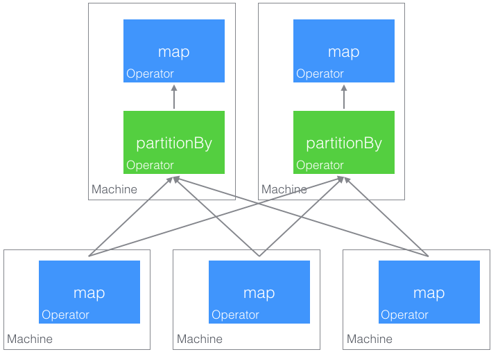
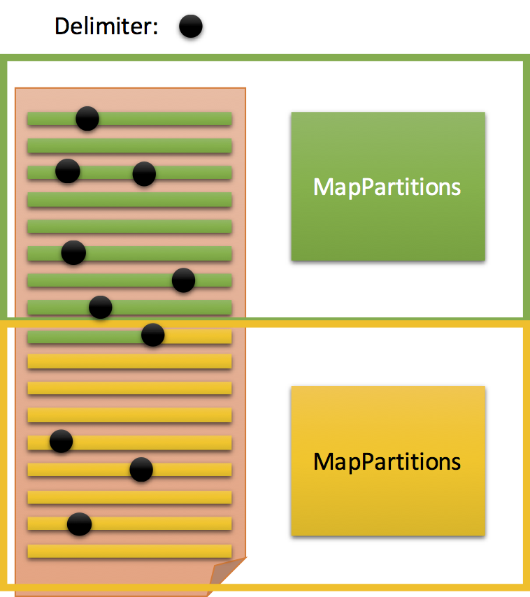

# Homework 3: PySpark
### CS186, UC Berkeley, Spring 2016
#### Points: [10% of your final grade](https://sites.google.com/site/cs186spring2016/home/basic-information)
#### Due: Thursday Feb 25, 2016, 11:59 PM
#### Note: *This homework is to be done individually!*


## Part 0: Introductions

### Review and Exploration
If you haven't already, peruse the [discussion notebook](https://github.com/berkeley-cs186/course/blob/master/discussion/wk3/PySparkPreview.ipynb) as a refresher on iterators, generators, and lambdas. You don't have to do this, but familiarity will make your life significantly easier :)

### Spark and Distributed Dataflow

Database systems compile SQL expressions down to an extended relational algebra composed of operators.
These operators are then instantiated in a simple iterator model, where each operator implements an iterator interface.

The Spark framework implements this idea in the distributed setting.
Spark is built around the *Resilient Distributed Dataset* (RDD), which can be thought of as a *view* on some underlying data source.

Consider the following example:
```python
# sc is the SparkContext and it is created at startup.
# Make an RDD containing integers 0 to 9
rdd = sc.parallelize(range(10))
# Make an RDD containing integers 1 to 10
rdd2 = rdd.map(lambda x: x + 1)
# Make an RDD containing tuples
rddL = rdd2.map(lambda x: (x, str(x)))
rddR = rdd2.map(lambda x: (x, float(x)))
joinedRDD = rddL.join(rddR)
```
In the first line we build an RDD over the integers 0 to 9 using the SparkContext `sc`. We then apply transformations and even express a join of two rdds based on their `keys`, defined as the first element in the tuples `(k,v)`.

It is important to note that RDDs are *immutable* so each transformation is just another view on the transformation before it (are you starting to see the dataflow?).

Just like views, these define transformations on top of transformations but don't actually execute any computation.
To execute this query and read the result we would need to apply an action like `joinedRDD.collect()` which would force data to flow through all the views and return the result of the computation as a python list.**

### **Caution: Spark is LAZY
To reiterate the above, most RDD operations are lazy; they define transformations (views) without executing those transformations.
For example, the following block of code will return instantly:
```python
rdd = sc.parallelize(range(1000)).map(lambda x: fibonacci(x))
```
It is not until you then run:
```python
results = rdd.collect()
```
that you realize you wrote a very slow program or that you might have a bug in fibonacci.
If you are ever wondering what your rdd contains, remember to experiment with `rdd.collect()` or `rdd.take()`.
In fact, the only operations that will actually trigger computation are:
```python
rdd.collect()
rdd.take(anInteger)
rdd.count() # a great way to execute your rdd
rdd.foreach(aFunctionThatReturnsNothing)
```

### Iterators and Partitions
As we mentioned above, Spark follows the basic distributed iterator model at its foundation.

The most basic operators in Spark are `rdd.mapPartitions(initializeIterator)`, `rddL.zipPartitions(rddR, initializeIterator)`, and `rdd.partitionBy(numParitions, hashFunction)`, which allow users to directly build their own operators and move tuples around the cluster.  How do these work? Let's first look at `rdd.mapPartitionsWithIndex` (a slightly fancier version of `rdd.mapPartitions`):
```python
rdd = sc.parallelize(range(20), 4)
plusOne = rdd.mapPartitionsWithIndex(lambda pid, inIter: ((pid, i+1) for i in inIter))
print plusOne.collect()
```
```
[(0, 1), (0, 2), (0, 3), (0, 4), (0, 5), (1, 6), (1, 7), (1, 8), (1, 9), (1, 10), (2, 11),
 (2, 12), (2, 13), (2, 14), (2, 15), (3, 16), (3, 17), (3, 18), (3, 19), (3, 20)]
```
The first line says that we want to create an RDD with numbers from 0 to 19 _partitioned_ over 4 logical partitions.  When executed, each of these partitions is assigned to worker threads either on our node or somewhere in the cluster.  Unless we apply the `rdd.coalesce` or `rdd.partitionBy` operators, each subsequent RDD built from this one will also be composed of 4 logical partitions.

The `rdd.mapPartitionsWithIndex` function (closely related to `mapPartitions`) takes a user defined function as an argument.
The user defined function takes two arguments partitionId (in this case a number between 0 and 3) and an input iterator `inIter`. The function then does whatever initialization it requires and returns a new iterator.
In this case we have implemented our own `+1` operator by using a python generator `(... for i in iterator)` to construct tuples consisting of the logical partition in which the tuple was computed, along with the `i+1` value.

When `collect` is invoked, Spark serializes the code in the current python session along with any state or variables that you reference and sends all of that information to the cluster to run on remote workers (or, in your case, other python processes spawned on your machine).

If we chain multiple `rdd.mapPartitions` together, each logical partition will only see the output from its previous logical partition.  To move data between partitions or create new partitions, we use `rdd.partitionBy(numPartitions, hashFun)`, which takes a hash function and uses it to reassign tuples (by key) to new logical partitions.  In the following, we illustrate how the `partitionBy` results in tuples being shuffled across machines:



Finally, the `rdd.zipPartitions` operator behaves much like the `rdd.mapPartitions` operator, but instead combines tuples from two separate RDDs on a per-partition basis (this is essential for implementing joins). Here is a simple example:
```python
rdd = sc.parallelize(range(20), 4)
zipper = rdd.zipPartitions(rdd, lambda lIter, rIter:
               iter(zip(list(lIter), list(reversed(list(rIter))))))
print zipper.collect()
```
```
[(0, 4), (1, 3), (2, 2), (3, 1), (4, 0), (5, 9), (6, 8), (7, 7), (8, 6), (9, 5), (10, 14),
 (11, 13), (12, 12), (13, 11), (14, 10), (15, 19), (16, 18), (17, 17), (18, 16), (19, 15)]
```
Notice how the resulting RDD joins the tuples from each of the input RDDs on a per partition basis.

### Mapping to Machines


<!--  -->

### Basic Setup
For this assignment, we will be working with [PySpark](http://spark.apache.org/docs/latest/programming-guide.html) via the Jupyter notebook interface.

As a reminder, you should launch the assignment like so:

    $ LOCAL:~        $ ssh -L 55555:localhost:55555 cs186-xxx@hiveXX.cs.berkeley.edu   # use the correct port number
    $ INST:~         $ cd xyz   # navigate to your repo directory
    $ INST:~/xyz     $ git pull course master
    $ INST:~/xyz     $ cd hw3
    $ INST:~/xyz/hw3 $ jupyter notebook

Instruction for retrieving the port/password can be found [here](https://github.com/berkeley-cs186/course/tree/master/hw1#running-jupyter-notebook).

To get started, open `HW3_I.ipynb` and run the first few code blocks to import everything you will need for this assignment.

#### Working Locally (Very Optional)
If you would like to work on your personal machine, we have provided a special script (commented out by default) that will attempt to download our modified version of Spark and PySpark in the local directory and configure your python environment. We’ve added `rdd.zipPartitions` in our version of PySpark (it can be found in the standard Scala and Java implementations). The script will not permanently set your environment variables, so you will need to run the script each time you restart the kernel (the script should only download PySpark once, as long as you don't delete the tarfile). Please take care to not push the PySpark files onto GitHub (you will only need to push `*.ipynb`).

**Note:** This is a new assignment, so there will be bugs. Let us know on Piazza if you find any! We will post updates (here and on Piazza) when bugs are found, so please bear with us and check back routinely.

### Useful Documentation:
- [Spark Programming Guide](http://spark.apache.org/docs/latest/programming-guide.html#transformations)
- [PySpark API](http://www.eecs.berkeley.edu/~jegonzal/pyspark/) (note that this version contains our extended functionality `zipPartitions`).

<!--
(https://spark.apache.org/docs/1.1.1/api/python/pyspark.rdd.RDD-class.html)
  - There is also a newer version [here](https://spark.apache.org/docs/1.6.0/api/python/pyspark.html#pyspark.RDD) (your choice!).
 -->

### Some Advice:
- **`utils`:** Peruse `utils` to see what functions and tools you are given to start off with.

- **Types:** Python is not statically typed, so input or output that does not match what is expected will throw many errors. To avoid this, [Spark Scala documentation](http://spark.apache.org/docs/latest/api/scala/index.html#org.apache.spark.rdd.RDD) might prove useful as most of the methods that we’re implementing in Parts 1 and 2 are _real_ methods with the same signatures as their Scala equivalents.

- **Key, Value:** There are some methods that implicitly expect (key, value) pairs! Be sure to look at the documentation in the above bullet point when running into issues. You will be doing a lot of `lambda (k, v): v` and `lambda x: (x, 1)` to reorganize your data, such that it matches the expected inputs to the various python functions.

- **Debugging:** We haven't included any special accommodations for debugging - the unfortunate reality is that printing inside an RDD method produces output in the terminal, as opposed to the notebook interface. You may create extra cells to test and play with code, but please keep your notebook orderly and delete scratch work before submission. Use `shift-enter` to run an individual cell, and `b` to create an extra cell below the current cell (you may need to `Esc` out of the cell you are editing).  That said we have tried to provide some test cells for functions that would normally be executed inside the RDD (e.g., `readlinesInPartition`) so you can test those functions before they are called from within Spark.

- **collect():** If you're stuck or confused, you may want to use `collect()` to verify what your dataset looks like.  That being said, we want you to utilize the Spark framework, so **you should not use collect() in your final implementations**, except perhaps selectively in Part 4. Note that `collect()` will produce an array, which will cause your code to fail when your dataset does not fit in memory.

- **The [OPTIONAL] tag:** These methods are only for _assistance_ in your code design. You are not required to fill them out. Keep in mind that though these methods are not graded, they are probably good for you (like vitamins).
 
- **Jupyter:**
 - We have noticed that sometimes Jupyter lazily flushes file buffers. You might want to look into
  [flush](https://docs.python.org/2/library/stdtypes.html?highlight=file%20flush#file.flush) should
  you suspect this to be happening.
 - Sometimes when the output seems unexpected, it might be worth clearing the 'kernel' by going to
  the Kernel tab, and click *'Restart and Clear Output'*. You should also do this before you git
  commit/push (since the runtime might be large and make your commit process and diff logs harder to
  parse).

---
**Note:** Parts 1 and 2 can be found in `HW3_I.ipynb`.

## Part 1: Intro to PySpark

As a warm-up, we would like you to perform a simple computation within the Spark framework. More importantly, we want you to get a feel for the broader context before diving into the nitty-gritty implementation details.

### 1.1: Implement countWords()
For this task, load the passed-in text file into an RDD using `sc.textFile` and return a **python list** of the 20 words that appear most frequently, along with their counts. You should convert all characters to lower case and split on any whitespace.  (If you happen to know what [stemming](https://en.wikipedia.org/wiki/Stemming) is, don't do it here -- we'll take the lowercased text verbatim.)

**Tips:**
- Potentially useful [PySpark methods](https://github.com/berkeley-cs186/course/blob/master/hw3/README.md#useful-documentation): `flatMap, map, reduceByKey, takeOrdered, and/or top` (you may change the provided `result_rdd.take(20)`)
- The output of this function should look like: `[('the', 692), ('and', 671), ('i', 638), … ('his', 165)]`
- Functions like `reduceByKey` operate on tuples in python that are of the form `(key, value)`.

## Part 2: Diving Right In - PySpark Fundamentals

### 2.1: TextFile
In Part 1, we took advantage of a built-in Spark method called `textFile`: it creates an RDD containing lines of text from a file on a [shared file system](https://hadoop.apache.org/docs/r1.2.1/hdfs_design.html).
The RDD loading mechanism works by assigning partitions to multiple parallel processes, each with a different position in the file. Each will read its corresponding partition of the file and extract lines from that partition.

To get a more hands-on understanding of how things work, we're going to implement our own `textFile` method in PySpark, which will be a bit more flexible by supporting custom line [delimiters](https://en.wikipedia.org/wiki/Delimiter).

Like any PySpark code, we should expect a separate instance of our code to be launched by Spark on each of many machines running in parallel.  All the instances of our code can read from the same file on the same filesystem, but should work on separate partitions of the file so that each line is produced exactly once.  Our method will need to use Python's [File Object API](https://docs.python.org/2/library/stdtypes.html#file-objects) to read in the appropriate bytes from the file and split them into lines.  The tricky bit here is to figure out what bytes to read on each instance, and how to produce (all of the) complete lines from the file across all the instances.  You may want to sketch this out on paper before you start coding--make sure to think about the messy cases up front!

Here is a hint:



<!-- #### 2.1.1: Implement readline()
Given an already-opened [Python file object](https://docs.python.org/2/library/stdtypes.html#file-objects), return the next sequence of text from the current position of the file object, up to and including the delimiter. You may assume that the delimiter is a single character (i.e. `'\n'`).
 -->

#### 2.1.1: Implement readlinesInPartition()
You are given a filename, a delimiter character and a specified number of instances (partitions) for Spark to parallelize across. Your challenge is to write code such that each instance will open the file and produce lines via your `readlinesInPartition()` method. Each line in the file should be produced by exactly one instance.  You should also take a look at `textFile()`, which will use the method you implement.

**Tips:**
- `textFile()` should return a generator (you should `yield` great things).
- The output of `readlinesInPartition()` should *not* include the delimiter.
- Use the file's size in bytes and number of partitions to help determine where in the file each partition should start loading from.  You don't have to split the file perfectly evenly (but you can if you like).
- The test we've included in `utils/tests.py` replaces all `'\n'`'s with `'\\n'`'s, which should make test output easier to parse. You can run these tests at the bottom of each notebook.


### 2.2: RDD Transformations

Much of the Spark RDD API can be built using a few basic RDD operations like `mapPartitionsWithIndex`, `zipPartitions`, and `partitionBy`.  In this part of the homework we will be writing several of the higher level operations using (`filter`, `flatMap`, `reduceByKey`, and `join`) using just these basic building blocks.  All functions in `utils/CleanRDD.py` are available for you to use - it is a subset of the actual RDD implementation. The purpose is for you to understand how to compose many transformations using basic primitives. Please do not try to break any abstraction barriers.

For this task, implement `filter`, `flatMap`, `reduceByKey`, and `join` (you may implement these in any order).  More details on what each function should do are provided in the notebook comment blocks.

---
**Note:** Parts 3 and 4 can be found in `HW3_II.ipynb`.

## Part 3: CacheMap

### 3.1 Implement ClockMap
Let's explore how we can add caching capabilities to an RDD, which would improve performance on some datasets. First, you should implement a cache with the clock replacement policy in `ClockMap`. It should operate as follows:
```python
clock = ClockMap(2, lambda x: x**2)
clock[6] = 36
clock[5] = 25
clock[1] = 1  # cache miss
clock[1] = 1  # cache hit
```
Check [this](https://docs.python.org/2/reference/datamodel.html#object.__getitem__) out if you are confused about how the `__getitem__` function works (needed to implement `clock[key]`).

### 3.2 Implement cacheMap
Then, fill out `cacheMap()` such that the output is the same as `rdd.map`, with each partition using a `ClockMap` to do its calculations. You may write helper functions if you desire.

## Part 4: External Algorithms
Let's now think about how we can externally sort RDDs. We'll merge ideas from both external hashing and external sorting to achieve this (remember the lectures on external two-phase algorithms?). You can use the built-in `sorted()` or `.sort` for any _in-memory_ sorting.

### Big picture:
`partitionByKey` is used to generate partitions. `externalSortStream` is used to sort each partition, in which you need to perform an external sort. `sortByKey` is the combining of the partitioning from above and the external sorting of the partition.

To reiterate, instead of having our procedure consist of solely partitioning -> merge, we will have 3 stages:
 - Partition (in which you will use sampling in order to mitigate the effects of data skews)
 - For each partition, apply the two-phase external sort:
   - Read in a run, sort the run
   - Merge all runs

### Primer on `keyfunc`:
The methods you are working with for this part will expect `(k, v)` pairs as your RDD elements. `keyfunc`, in the method signatures, is a function that is _only_ applied to the `k` value:
```python
keyfunc=lambda k: do_something(k)
```
Another example of `keyfunc` in use - if the RDD has following elements of the form `(student, None)`:
```python
rdd # contains [(Alexa, None), (Tony, None), (Rohit, None)]
Alexa.gpa = 3.9
Tony.gpa = 0.7
Rohit.gpa = 2.0
```
Then we can apply `keyfunc` in the following manner:
```python
>>> keyfunc_GPA=lambda std: std.gpa
>>> rdd.sortByKey(keyfunc=keyfunc_GPA).collect()
[(Tony, None), (Rohit, None), (Alexa, None)]
```
If you need to do this with the built-in `sort` or `sorted()` methods, take a look at [this for guidance](https://wiki.python.org/moin/HowTo/Sorting#Key_Functions).

### 4.1 External Sort
Fill out the following function:
```python
def externalSortStream(iterator, keyfunc=None, reverse=False, serial=serializer, limit=10, batch=100)
```
Instructions/Tips for `externalSortStream` (note that this is slightly different from the algorithm in class - why?):
 - Read in bunches of elements at a time - use the `batch` as a guideline for how much you should read in at once. A (very) loose metaphor for a `batch` is a page.
 - If we want to further the analogy, recall that each run is often composed of multiple pages. How many pages exactly? `limit` will help you. Treat `limit` as a soft limit in reading in pages (ie, if you overflow from a read, you do not need to truncate).
 - You will find `itertools.islice` to be helpful in implementing the batch reading.
 - `limit` is in terms of MB. Use the function `get_used_memory()` for calculating how much memory you've currently used.
 - As with each run in an external sort, you will want to sort and output it to disk. Sort using the python built-in sorting mechanism, and write out using our provided `serializer`.
  - `serializer` object is imported for you from `utils`.
  - The `serializer` is used to transfer a stream (in our case, an iterator) to and from disk.
  - `serializer` methods include `.dump_stream(iterable, file)` and `.load_stream(file)`. You can treat the return value of `load_stream` as an iterable.
 - If you can't decide on a file naming convention, use `get_sort_dir()` and move on.
 - You should probably get rid of your temporary file runs - you can use `os.unlink` to delete a file. Special note: it will not delete a file currently open/in use - if this function is called on a file, the file will not be deleted until the file is closed.
 - Merge is done for you via `heapq.merge`. Please reference the [API](https://docs.python.org/2/library/heapq.html#heapq.merge) for further information of usage.
 - Partial credit will be given for non-external (internal) sort implementations.

### 4.2 Bucket Sampling and Partitioning
Fill out the function:
```python
def partitionByKey(self, ascending=True, numPartitions=None, keyfunc=lambda x: x)
```
You want to write a function that samples the RDD and partitions the data in such a way that we can get approximately evenly distributed partitions. We have taken care of the parameter edge cases.

Instructions:
 - `getBuckets` will help you modularize your implementation - it is up to you as to how you want to use it.
 - Try sampling about 10 per partition (expected value). You can do this using the given `sample` function (without replacement).
 - Use these samples (maybe `collect` it?) to find (a list of) boundaries for each bucket.
 - You want to write a function that will bucket your data (think coarse partitioning) - given that you've calculated your buckets
 - The `partitionBy`  assumes all your elements are `(k, v)` pairs. It has a parameter `partitionFunc` that takes in a function (replace `balanceLoad` that takes in a key and outputs the index of the bucket.
 - `bisect.bisect_left` will come in handy.
 - Use Google or the Python API if you're lost.

### 4.3 Wire it together
Fill out the function:
```python
def sortByKey(rdd, ascending=True, numPartitions=None, keyfunc=lambda x: x)
```
Using the functions from above.

## Testing
At the bottom of each notebook will be several tests** - run them to check and verify your output (we will not have an autograder set up on `ag/hw3`).  Your test output (along with diffs, if your test fails) will be located in `your_output/`, and reference output is in `ref_output_dir/`. We will be grading on a separate, more rigorous set of tests, so you are encouraged to write tests yourself.  

_**featuring Shakespeare's [As You Like It](http://shakespeare.mit.edu/asyoulikeit/full.html)_

## Submission instructions
To submit, remember to push to `release/hw3` with:

    $ git push origin master:release/hw3

Detailed submission instructions are in [HW0](https://github.com/berkeley-cs186/course/tree/master/hw0).

#### Please?
Fill out our [HW3 Evaluation and Feedback form](https://docs.google.com/a/berkeley.edu/forms/d/1i-e2ycn3q9GRvufmon7cI7U5M9NimpwUjgWbdTKYnKg/viewform) to help us with HW5 and future iterations of this course!
